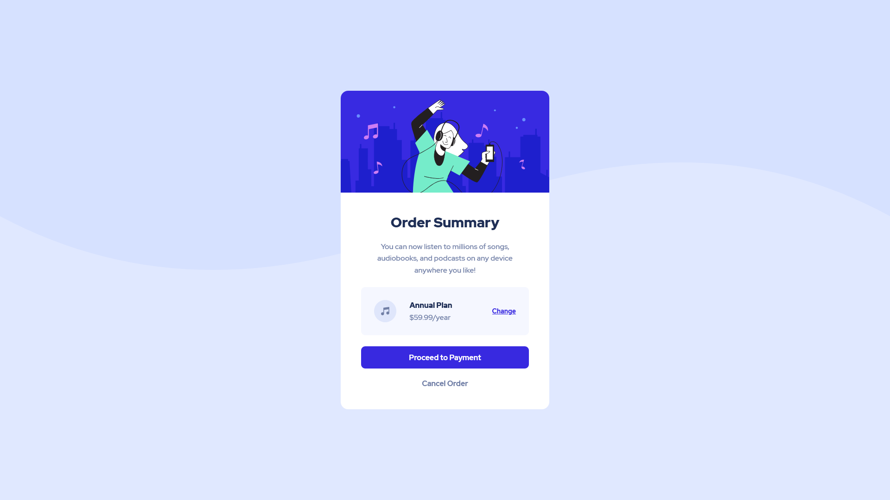

# Frontend Mentor - Order summary card solution

This is a solution to the [Order summary card challenge on Frontend Mentor](https://www.frontendmentor.io/challenges/order-summary-component-QlPmajDUj). Frontend Mentor challenges help you improve your coding skills by building realistic projects.

## Table of contents

- [Overview](#overview)
  - [The challenge](#the-challenge)
  - [Screenshot](#screenshot)
  - [Links](#links)
- [My process](#my-process)
  - [Built with](#built-with)
  - [What I learned](#what-i-learned)
- [Author](#author)

## Overview

### The challenge

Users should be able to:

- See hover states for interactive elements

### Screenshot



### Links

- Solution URL: [Solution link](https://www.frontendmentor.io/solutions/order-summary-component-Iwrhjq3LX)
- Live Site URL: [Live Link](https://imadosan.github.io/order-summary-component/)

## My process

### Built with

- Semantic HTML5 markup
- CSS custom properties
- Flexbox
- CSS Grid

### What I learned

After finishing a HTML & CSS course on udemy. I have decided to try to build this design on my own, without the help of a constructor or a tutorial. I'm glad that I managed to implement this design into code. I'm really proud of how it turned out, and looking forward to do more challenges like these in the future.

My first time using CSS custom properties

```css
:root {
  --pale-blue: hsl(225, 100%, 94%);
  --bright-blue: hsl(245, 75%, 52%);
  --very-pale-blue: hsl(225, 100%, 98%);
  --desaturated-blue: hsl(224, 23%, 55%);
  --dark-blue: hsl(223, 47%, 23%);
}
```

Insted of using margin bottom for every section. I used flexbox and switch the flex direction into column, then use the gap property

```css
.card-wrapper {
  display: flex;
  flex-direction: column;
  align-items: center;
  justify-content: center;
  gap: 2.4rem;
  margin: 0 4.4rem;
}
```

## Author

- Frontend Mentor - [@imadosan](https://www.frontendmentor.io/profile/imadosan)
- Twitter - [@imadosan](https://twitter.com/imadosan)
